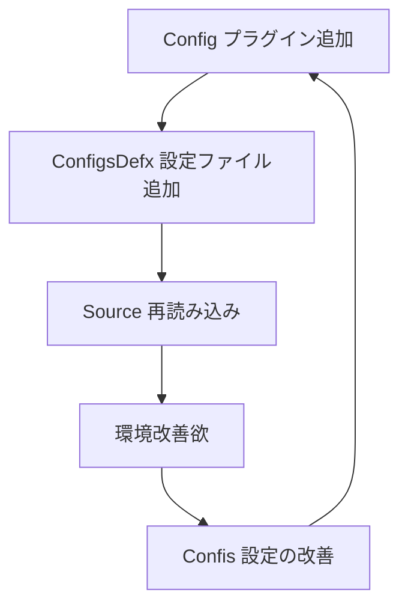

こんにちは。こまもかです。今回はVimのQOLを上げる僕なりのVimの設定管理方法を紹介して行きたいと思います。

## プラグインマネージャ

僕は現在プラグインマネージャに[vim-jetpack]()を使用しています。
しかし、僕の管理方法はプラグインマネージャの機能に依存していないのでお好きなプラグインマネージャを使用する事ができます。

## コマンド

僕が設定ファイル関係で自作したコマンドは以下の通りです。
(僕はNeovimを使っているファイルのパスになっています。)

### Config

```vim
command! Config :e $MYVIMRC
```

`Config`コマンドはVimの設定ファイルを開くように設定したあります。
設定ファイルのパスを`$MYVIMRC`にしてあるため、Vim/Neovimどちらでも使うことが出来ます。

### Configs

```vim
command! Configs :call ddu#start({'sources': [{'name': 'file_rec', 'params': {'path': expand('~/.config/nvim/configs')}}]})
```

`Configs`コマンドは各プラグインの設定ファイルが配置されている、`~/.config/nvim/confgis`ディレクトリを[ddu.vim](https://github.com/Shougo/ddu.vim)で開くようにしてあります。
こうすることで、設定したいプラグインの名前を検索してすぐに設定を始めることが出来ます。

このコマンドは[fzf.vim](https://github.com/junegunn/fzf.vim)や、[telescope.vim](https://github.com/nvim-telescope/telescope.nvim)などのプラグインでも代用可能です。

### ConfigsDefx

```vim
command! ConfigsDefx :Defx ~/.config/nvim/configs
```

`ConfigDefx`コマンドは、`configs`ディレクトリを[defx.vim](https://github.com/Shougo/defx.nvim)で開くコマンドです。このコマンドは新しいプラグインをインストールした時に、設定ファイルを追加しやすくする為のコマンドです。

また、このコマンドも、[Fern.vim]()や、Netrwでも代用可能です。

### Source

```vim
command! Source :source $MYVIMRC
```

`Source`コマンドはVimの設定ファイルを再読み込みします。
`$MYVIMRC`を使用しているのでVimでも使用可能です。

### ディレクトリ構造

```
├── configs
│   ├── cmds.vim
│   ├── cmode.vim
│   ├── coc.vim
│   ├── ddc.vim
│   ├── defx-git.vim
│   ├── defx.vim
│   ├── denite.vim
│   ├── easymoation.vim
│   ├── eskk.vim
│   ├── keybinds.vim
│   ├── lightline.vim
│   ├── medley.vim
│   ├── plugs.vim.nop 無効化してる設定はnopを付けている
│   ├── previm.vim
│   ├── scripts.vim
│   ├── skkeleton.vim.nop
│   ├── smartword.vim
│   ├── tig.vim
│   ├── twitvim.vim
│   ├── varset.vim
│   ├── vim-emoji.vim
│   └── vim-splash.vim
└── init.vim
```

:::message
使わなくなったプラグインの設定ファイルはトラブルの元になるので、一時的な場合は`nop`を最後に付けて設定ファイルを無効化しています。
:::

## 使い方

設定のワークフロー



1. `Config`コマンドでプラグインを追加します。
   プラグインが追加出来れば良いので、dein.vimを使っている人などは`dein.toml`などを編集すればOKです。

2. ConfigDefxコマンドで設定ファイルを追加します。
   プラグインを追加した後はこのコマンドで`プラグイン名.vim`というファイルを追加・編集します。

3. Source 設定の適用 設定を変更した後は`source`コマンドで適用します。
   僕は`source`コマンドを打つのが面倒なので自作の`Source`コマンドを使っています。

4. 環境改善欲
   READMEなどに載っている設定例などを設定しても、デフォルトのキーバインドと衝突したり、使いずらかったりするので、必ず設定を変えたりしたいと思うはずです。

5. Configs 設定の改善
   変更したいプラグインの設定ファイルを素早く見つける為にファジーファインダープラグインで該当のディレクトリを開くようにしておくと便利です。

## まとめ

今回はVimの設定管理方法を書きました。管理方法をまとめながらこの管理方法でもまだ自動化などで効率を上げられると感じたので今後もこの管理方法を磨いていきたいと思いました。
また、今回の記事はVimでSKKを使って書きました。SKKは取っつきにくいですが、慣れると流れるように文章が書けて快適ですね。今後もバシバシ使って行こうと思います。
